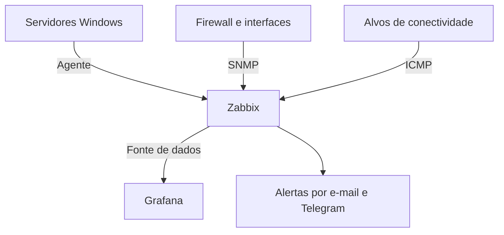

# NOC com Zabbix e Grafana

**Autor: Endrigo Henrique Deronzi · Infraestrutura, redes e segurança**

Projeto de portfólio baseado na experiência de implantação de monitoramento centralizado. Esta edição foi reconstruída com dados fictícios: não contém exportações, capturas de produção, credenciais ou informações da organização.

## Objetivo
Centralizar disponibilidade, consumo de recursos e falhas de comunicação em uma visão NOC, apoiando a triagem de incidentes e a priorização operacional.

## Escopo demonstrado
- Servidores Windows: CPU, memória, disco C:, uptime e disponibilidade do agente.
- Conectividade: ICMP, latência e perda de pacotes.
- Links: tráfego por SNMP e contadores de 64 bits.
- Visualização: cards de servidores e painel de problemas.
- Alertas: exemplos de mensagens de falha e recuperação para e-mail e Telegram.

## Arquitetura

## Minha contribuição
Configuração de métricas e indicadores, construção de cards para acompanhamento NOC, tratamento de itens sem dados e estruturação de notificações de problema e recuperação. As configurações deste repositório são exemplos reconstruídos para estudo.

## Navegação
- [Configuração e métricas](docs/configuracao.md)
- [Triagem de incidentes](docs/runbook.md)
- [Alertas demonstrativos](examples/alertas.md)
- [Dados fictícios](examples/hosts.json)
- [Card HTML/CSS](dashboard/card.html)
- [Privacidade e limitações](docs/privacidade.md)

## Como explorar
1. Consulte os itens e unidades no guia de configuração.
2. Abra `dashboard/card.html` no navegador para visualizar um card estático com dados fictícios.
3. Use `examples/hosts.json` como referência de nomenclatura para um laboratório.
4. Em um ambiente próprio, configure a fonte Zabbix no Grafana e associe as consultas às métricas.

O card não é um dashboard importável e não consulta sistemas. Não foi executado um laboratório Zabbix/Grafana nesta entrega. Não há números de redução de incidentes ou disponibilidade apresentados como resultados medidos.

## Evolução planejada
- Exportação de dashboard de laboratório com datasource parametrizada.
- Validação de coleta em laboratório Windows.
- Métricas de AD, DNS e DHCP.
- Integração de eventos de segurança como etapa separada.

## Competências demonstradas
Zabbix · Grafana · Windows · SNMP · ICMP · Monitoramento de infraestrutura · Triagem de incidentes · Documentação técnica
